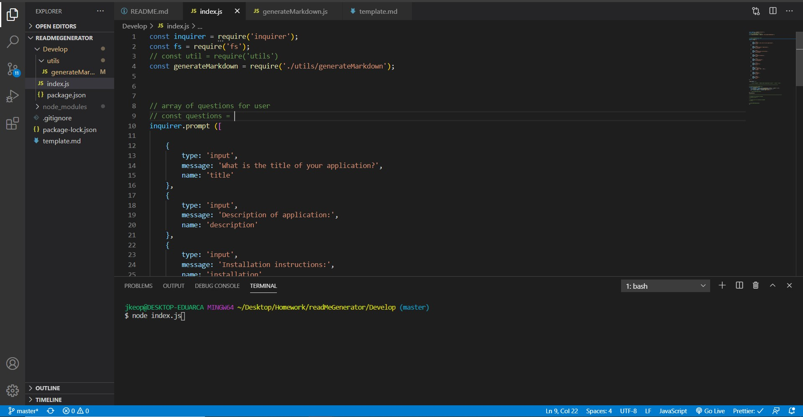

# README Generator

---

## Description

As a Developer, this readme generator provides a template for markdown files structured to give the user background information regarding the applications development process.

## Goals

1. Using Inquirer NPM, the prompt function provides a template to generate readme files
2. Executing through the terminal provides a series of prompts from objects containing questions that can be edited for personalization
3. A screenshot and link are provided to preview the application

 
[ReadMe Generator](https://drive.google.com/file/d/1Mru4WpKz--b-rbf9ZQMe-SaezxX_ROV7/view)

## Technology Used

- Node JS
- Inquirer
- Javascript

## Table of Contents

[Installation](#installation) 
[Usage](#usage) 
[Contributions](#contributions) 
[Description](#description) 

## Installation

Open terminal and execute 'node index.js'

## Usage

ReadMe file generating.

## Contributions

Jon Keopangna

## Testing

N/A

## License

 
For more information use the link provided.

## Contact For Questions

Github: [Jkeopangna](https://github.com/jkeopangna/readMeGenerator) 
Email: [Jkeopangna@gmail](https://gmail.com)
